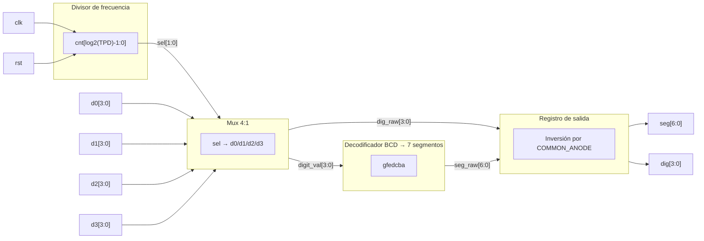

# Proyecto corto III – Unidad división de enteros HDL
## Implementación de máquinas de estados para el diseño de algoritmos

## Escuela de Ingeniería Electrónica
**Curso:** EL-3307 Diseño Lógico

**Profesor:** Oscar Caravaca

**Semestre:** I Semestre 2026  

--- 
## Integrantes
- Andrés Obregón López
- Mariana Solano Gutiérrez
- Mariana Guerrero Morales
---

## Abreviaturas y definiciones
- **FPGA**: Field Programmable Gate Arrays
- **HDL**: Hardware Description Language
- **SRC**: Source

## Herramientas Utilizadas
- **Lenguaje de descripción de hardware**: Verilog
- **Plataforma de desarrollo**: FPGA Nano Tang 9k
- **Multisim**: Para simulación de circuitos digitales
- **Digital works**: Para simulación de circuitos digitales
- **GTKWave**: Para verificación gráfica de señales en simulaciones

## Referencias
[0] David Harris y Sarah Harris. *Digital Design and Computer Architecture. RISC-V Edition.* Morgan Kaufmann, 2022. ISBN: 978-0-12-820064-3

[1] [FZumb4do. open_source_fpga_environment](https://github.com/FZumb4do/open_source_fpga_environment.git) 

[2] [LUSHAYLABS. Tang Nano 9K: Getting Setup](https://learn.lushaylabs.com/getting-setup-with-the-tang-nano-9k/)

[3] [Sipeed Wiki — Tang Nano 9K](https://wiki.sipeed.com/hardware/en/tang/Tang-Nano-9K/Nano-9K.html)

## Objetivo
Implementar una unidad de división de enteros sin signo mediante la utilización de máquinas de estados en Verilog HDL.

# Descripción general del sistema

En este proyecto se abordará el diseño e implementación de una unidad de división de enteros sin signo. Este sistema recibe dos números: Un dividendo de 6bits (63D máx) y un divisor de 4bits (15D máx) mediante una entrada en teclado matricial y representado para el usuario en una matriz de 4x7 segmentos. Luego el sistema realiza la operación de división mediante el algoritmo visto en clase basado en maquina de estados. El resultado "Cociente" y "Residuo" serán mostrados en la matriz de 4x7 segmentos. El sistema se implementará utilizando el lenguaje de descripción de hardware Verilog y se probará en una FPGA Nano Tang 9k.

Montaje paso a paso del proyecto visita:
[** Wiki Home ** ](https://github.com/Andy2335/Py03_UnidadDivEnt/wiki)

## Estructura de la documentación
- `README.md`, Descripción general del proyecto
- `docs`, Especificaciones, esquemas, hojas de datos, imagenes, simulaciones, etc.
- `wiki`, Explicación detallada "Tutorial"
- `src`, Código fuente del proyecto, organizado en dispositivo y módulos
- `build`, Makerfile, scripts de compilación, archivos de configuración, etc.
- `constr`, Constraints - Definición de pines.
- `design`, Implementación lógica programada y funciones.
- `sim`, Testbenches y archivos de simulación.

## Diagrama de Bloques - Unidad División de Enteros:

## Diagrama de Bloques - Subsistema de conversión:

## Jerarquía del sistema

